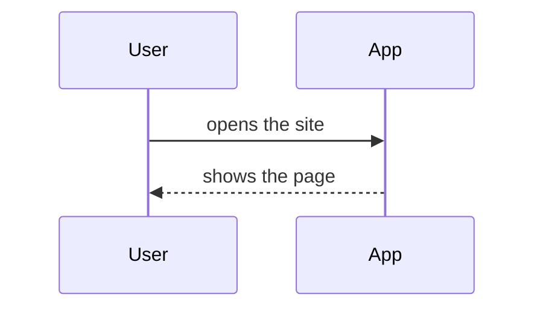

# infra.md: how {{PROJECT_NAME}} is built

The technical knowledge base. It holds what is true about the system right now and crosses more
than one feature. Per-feature detail lives in each feature's `guide.md`; exact database columns
live in the schema file; the reasons behind choices live in `docs/decisions.md`. This file is
living: it must match reality at every merge, and the pull request checklist asks for it.

Each section opens with one plain sentence for the owner, then the detail.

## Stack at a glance

What the thing is built from.

| Part | Choice | Why (short; full reasoning in D-001) |
|---|---|---|
| Framework (the code that renders pages and handles requests) | {{FRAMEWORK}} | TBD(claude): one line |
| Database (where information is stored) | {{DATABASE}} | TBD(claude): one line |
| Sign-in (how users prove who they are) | {{AUTH}} | TBD(claude): one line |
| Hosting (where the live site runs) | {{HOSTING}} | TBD(claude): one line |
| Payments | TBD(owner): none yet, or the provider | |
| Key libraries | TBD(claude): filled during tech setup, with versions | |

## Environments

Where things run and which data each one touches.

| Environment | What it is | URL | Data |
|---|---|---|---|
| Local | The app running on the owner's or Claude's machine | http://localhost:3000 | Local or a dedicated dev database; seeded test data |
| Preview | A temporary copy the host builds for every pull request | Given by {{HOSTING}} per pull request | TBD(claude): which database previews use |
| Production | The live site | TBD(owner): domain | The real database. Never used for testing |

## Identities and access

Who can do what, and where the keys live. Never values, only names and owners.

### Accounts and services

| Service | Used for | Account owner | Notes |
|---|---|---|---|
| GitHub | The repository; every release starts here | {{OWNER}} | TBD(owner): repository URL |
| {{HOSTING}} | Builds and serves the site | {{OWNER}} | Connected to the GitHub repository; `main` deploys to production |
| {{DATABASE}} | Database and sign-in | {{OWNER}} | TBD(owner): project URL |

### Roles inside the app

| Role | Who | May do | May not do |
|---|---|---|---|
| TBD(claude): from the interview | | | |

### Test identities

| Identity | Where it exists | Purpose |
|---|---|---|
| Localhost test login | Local only, never in production builds | Lets Claude and the owner sign in without a real account |
| Seeded test user | Local and, once created, production under a `TEST-` marker | The only identity QA may write with once real data exists |

### Environment variables

Names only. Values live in `.env.local` (gitignored) and in the host's environment settings.

| Name | Purpose | Where set |
|---|---|---|
| TBD(claude): fill from the chosen stack during tech setup | | |

## Data model

What the system remembers, at the level of things and their relationships. Exact columns live in
the schema file (see below).

- Schema file: TBD(claude): path, created during tech setup
- Immutable or append-only records: TBD(owner): none yet, or list them; each one is also a tripwire in AGENTS.md

## Key flows

How the important things happen, step by step. One sequence diagram per critical path: sign-in,
the main use case, and anything that touches money or private data.

## External services

What the system depends on and what happens when each one is down.

| Service | Used for | If it is down |
|---|---|---|
| TBD(claude): fill as integrations are added | | |

## Operations

How to keep it running.

- Deploy: merge to `main`; {{HOSTING}} builds and deploys. See `workflow.md`.
- Rollback: revert the merge commit and push. Nothing else.
- Logs: TBD(claude): where to look, filled during tech setup
- Backups: TBD(claude): what the database provider does automatically, and how to restore
- When something breaks: check the host's deploy log first, then the database provider's status page, then the app logs

## Constraints and gotchas

Things that look wrong but are intentional, with the decision that explains them.

- None yet.
