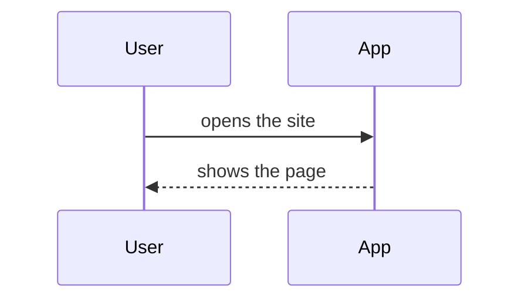

# infra.md: how ChoirHub is built

The technical knowledge base. It holds what is true about the system right now and crosses more
than one feature. Per-feature detail lives in each feature's `guide.md`; exact database columns
live in the schema file; the reasons behind choices live in `docs/decisions.md`. This file is
living: it must match reality at every merge, and the pull request checklist asks for it.

Each section opens with one plain sentence for the owner, then the detail.

## Stack at a glance

What the thing is built from.

| Part | Choice | Why (short; full reasoning in D-001) |
|---|---|---|
| Framework (the code that renders pages and handles requests) | Next.js | One responsive website that works on a phone; Vercel deploys it with no configuration |
| Database (where information is stored) | Postgres (Supabase) | A real database with automatic backups, and rules that can forbid an edit rather than trusting us to avoid one |
| Sign-in (how users prove who they are) | Supabase Auth | Comes with the same project: email link for everyone, Google for those who prefer it |
| Hosting (where the live site runs) | Vercel | Sasha already has the account; `main` deploys itself, so nobody ever deploys by hand |
| Payments | None yet. Money arrives at milestone 3 (membership fees) and the provider is chosen then, as its own decision | |
| Key libraries | TBD(claude): filled during tech setup, with versions | |

## Environments

Where things run and which data each one touches.

| Environment | What it is | URL | Data |
|---|---|---|---|
| Local | The app running on the owner's or Claude's machine | http://localhost:3000 | Local or a dedicated dev database; seeded test data |
| Preview | A temporary copy the host builds for every pull request | Given by Vercel per pull request | The development database, never production. Anything behind sign-in is checked on localhost instead |
| Production | The live site | TBD(owner): domain | The real database. Never used for testing |

## Identities and access

Who can do what, and where the keys live. Never values, only names and owners.

### Accounts and services

| Service | Used for | Account owner | Notes |
|---|---|---|---|
| GitHub | The repository; every release starts here | Sasha | Account exists. TBD(owner): repository URL |
| Vercel | Builds and serves the site | Sasha | Account exists. Connected to the GitHub repository; `main` deploys to production |
| Postgres (Supabase) | Database and sign-in | Sasha | To be created at tech setup. TBD(owner): project URL |
| Google Cloud (OAuth client) | Only if singers sign in with Google | Sasha | Optional. Email sign-in needs nothing extra; Google sign-in needs one free OAuth client |
| Payments provider | Membership fees | Sasha | Not yet. Needed at milestone 3, not before |

### Roles inside the app

| Role | Who | May do | May not do |
|---|---|---|---|
| Conductor | Sasha, and anyone she names later | Create and change rehearsals; add and remove singers; see every singer's contact details and every reply by name; later record attendance and see fees | Change a reply or an attendance record once the rehearsal has started |
| Singer | A member of the choir with a sign-in | See the term's rehearsals; answer coming or not coming for themselves and change that answer until the rehearsal starts; see how many are coming | See any other singer's email, phone number, or individual answer; answer for anyone else; create or change a rehearsal |
| Section leader | Nobody yet | Not built. Sasha named it as a maybe; it is a roadmap idea, not a role that exists | |

### Test identities

| Identity | Where it exists | Purpose |
|---|---|---|
| Localhost test login | Local only, never in production builds | Lets Claude and the owner sign in without a real account |
| Seeded test user | Local and, once created, production under a `TEST-` marker | The only identity QA may write with once real data exists |

### Security baseline

Filled during tech setup from the security playbook. Each line carries evidence, not a promise.

| Control | Status | Evidence |
|---|---|---|
| Secrets only in host settings and `.env.local`; none in repository history | TBD(claude) | |
| Row-level rules on every table, default deny; server key never in the browser | TBD(claude) | |
| Sign-in expiry configured; test login absent from production builds | TBD(claude) | |
| HTTPS only; security headers set | TBD(claude) | |
| Backups on; restore tried once | TBD(claude) | |
| Dependency audit in the verify script | TBD(claude) | |
| No personal data in logs | TBD(claude) | |

### Environment variables

Names only. Values live in `.env.local` (gitignored) and in the host's environment settings.

| Name | Purpose | Where set |
|---|---|---|
| `NEXT_PUBLIC_SUPABASE_URL` | Which Supabase project the app talks to | `.env.local` and Vercel, all environments |
| `NEXT_PUBLIC_SUPABASE_ANON_KEY` | The public key the browser may hold; it can only do what the database rules allow | `.env.local` and Vercel, all environments |
| `SUPABASE_SERVICE_ROLE_KEY` | The server-only key that bypasses the database rules. Never sent to a browser, never in a `NEXT_PUBLIC_` name | `.env.local` and Vercel, server environment only |
| `NEXT_PUBLIC_SITE_URL` | Where sign-in links come back to, per environment | `.env.local` and Vercel, per environment |
| TBD(claude): anything else the stack needs, added during tech setup | | |

## Data model

What the system remembers, at the level of things and their relationships. Exact columns live in
the schema file (see below).

- Schema file: TBD(claude): path, created during tech setup
- Immutable or append-only records: singers' replies and (from milestone 2) attendance entries.
  A singer changing their mind before the rehearsal writes a new entry that supersedes the old
  one; nothing is overwritten, and once the rehearsal has started nothing changes at all. This is
  the first tripwire in AGENTS.md, and it is enforced by the database rules, not by discipline.

## Key flows

How the important things happen, step by step. One sequence diagram per critical path: sign-in,
the main use case, and anything that touches money or private data.

## External services

What the system depends on and what happens when each one is down.

| Service | Used for | If it is down |
|---|---|---|
| TBD(claude): fill as integrations are added | | |
| AI model provider, if any feature has an AI component | TBD(claude): chosen at the first AI component, recorded as a decision | The feature degrades to its manual path |

## Operations

How to keep it running.

- Deploy: merge to `main`; Vercel builds and deploys. See `workflow.md`.
- Rollback: revert the merge commit and push. Nothing else.
- Logs: TBD(claude): where to look, filled during tech setup
- Backups: TBD(claude): what the database provider does automatically, and how to restore
- When something breaks: check the host's deploy log first, then the database provider's status page, then the app logs

## Constraints and gotchas

Things that look wrong but are intentional, with the decision that explains them.

- None yet.
